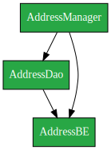
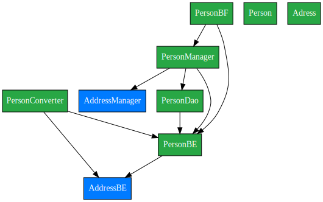

# graphviz is required

- `brew install graphviz`

- https://codefreezr.github.io/awesome-graphviz/#libs-for-node--js--jquery--d3

# Result

## Packge Overview

## Package adresses

## Package adresses

