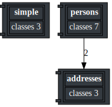
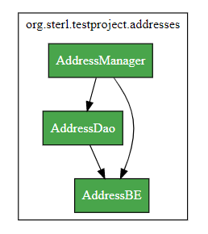
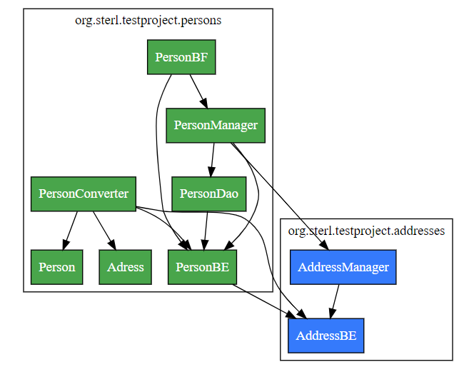

# Preview

- **[Live Preview Sample](https://sterlp.github.io/open-architect/sample.html)**
- **[Live Preview Spring-Pet-Clinic](https://sterlp.github.io/open-architect/Spring-Pet-Clinic.html)**

# 3djs graphviz used
- https://codefreezr.github.io/awesome-graphviz/#libs-for-node--js--jquery--d3

# Result

## Packge Overview

## Package adresses

## Package persons

# Links

- http://viz-js.com/
- https://github.com/magjac/d3-graphviz
- https://graphviz.org/
